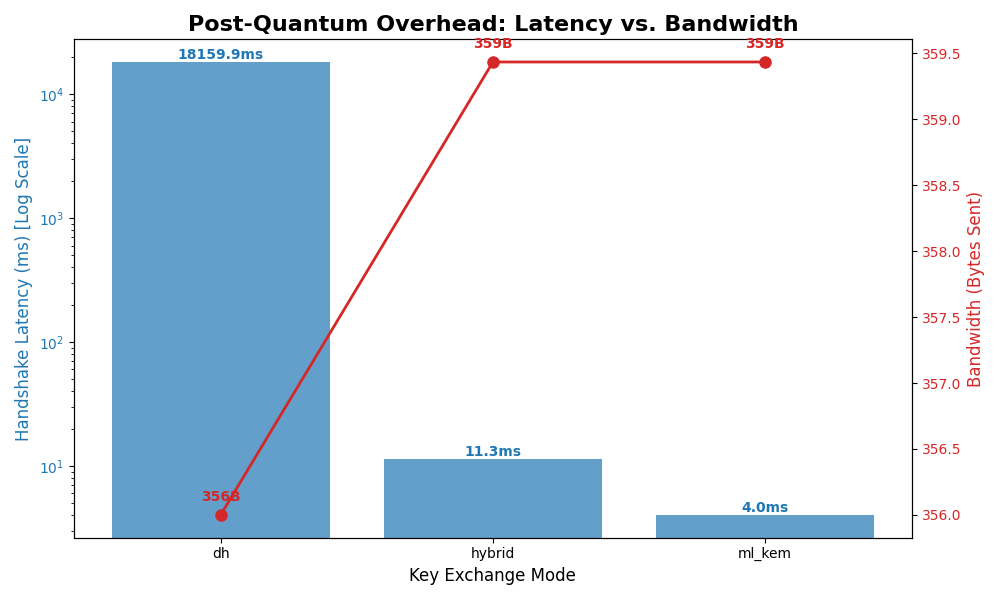

# Quantum-Secure Messaging Platform

A production-inspired, end-to-end encrypted messaging platform built to demonstrate the viability and performance tradeoffs of migrating from classical cryptography to Post-Quantum standards (NIST FIPS 203).



## 📌 The Problem
"Store-now, decrypt-later" (SNDL) attacks threaten all modern communication. Adversaries are actively harvesting E2E-encrypted traffic today, waiting for the advent of cryptographically relevant quantum computers (CRQCs) to break classical algorithms like Diffie-Hellman and RSA via Shor's Algorithm.

## 🚀 The Solution
This project proves that migrating to post-quantum cryptography is completely viable for real-time messaging today. It is a feature-complete secure chat platform that allows users to toggle between three Key Exchange (KEX) modes in real-time, visualizing the latency and bandwidth tradeoffs of each:

1. **Diffie-Hellman (`dh`)**: The classical standard (vulnerable to quantum attacks).
2. **ML-KEM-768 (`ml_kem`)**: The new NIST Post-Quantum standard.
3. **Hybrid Mode (`hybrid`)**: Safely combines X25519 and ML-KEM-768 using an HKDF-SHA256 combiner. *(Industry Best Practice)*

## 🏗️ Architecture & Technical Highlights
* **Asynchronous Backend**: Built with FastAPI and `websockets` for high-concurrency event loops.
* **Synchronous Crypto Adapter**: The heavy, CPU-bound cryptographic operations (AES-GCM, Kyber matrix math) are completely isolated from the async event loop using a custom `WebSocketAdapter` and threadpool pattern.
* **Server-Trusted Transport**: The architecture is "Server-Trusted". Payloads are E2E-encrypted between the client and the server for transport and auth, but decrypted at the router for offline persistence and delivery tracking.
* **Persistent Offline Queues**: Uses SQLite in WAL (Write-Ahead-Log) mode with a thread-safe single-writer routing engine. Messages sent to offline users are securely queued and instantly drained upon login.
* **Replay & Tamper Resistance**: Enforces a strict 5-minute sliding timestamp window and tracks `message_id` deduplication to actively reject MITM replay attacks. Any bit-flips in the AES-256-GCM ciphertexts instantly raise `InvalidTag` exceptions.
* **Live Telemetry UI**: A fully-fledged Streamlit web dashboard ("Crypto Inspector") that plots exact byte-sizes and latency overhead per message.

---

## 🛠️ Quickstart & Demo Guide

### Option 1: Docker (Recommended)
You can launch the entire stack (Database, FastAPI, Streamlit) with a single command. It will auto-provision two demo users (`alice` and `bob`, password: `secret`).
```bash
docker build -t secure-chat .
docker run -p 8501:8501 -p 65432:65432 secure-chat
```
Navigate to `http://localhost:8501` to view the application!

### Option 2: Local Python Execution
1. Install dependencies: `pip install -r requirements.txt`
2. Register users:
   ```bash
   python backend/register.py --user alice --password secret
   python backend/register.py --user bob --password secret
   ```
3. Start the backend: `uvicorn backend.server_async:app --host 127.0.0.1 --port 65432`
4. Start the UI: `streamlit run frontend/app.py`

---

## 🎭 The 2-Minute Demo Script (For Interviews/Evaluators)
To properly demonstrate the system-level novelty:

1. **Show the Baseline**: Log into Streamlit as `alice`. Set Key Exchange Mode to `dh`. Send a message. Point out the *Crypto Inspector* telemetry on the right: the handshake took a few milliseconds and the bandwidth overhead was tiny (~200 Bytes).
2. **Show the Post-Quantum Upgrade**: Switch the mode to `ml_kem`. Send another message. The math is astonishingly fast, but point out the massive bandwidth penalty (the payload jumps to over 2,000 Bytes due to large PQ public keys).
3. **Show the Hybrid Standard**: Switch to `hybrid`. Explain that this mode mixes classical and PQ keys to ensure safety even if the new NIST standard is mathematically broken in the future.
4. **Show Offline Routing**: Open an Incognito Window and log in as `bob`. Bob will instantly receive all three messages directly from his offline SQLite queue.
5. **Show Tamper Resistance**: You can run `pytest tests/` to demonstrate that tampered packets and replayed message IDs are hard-rejected by the backend's cryptographic validators.